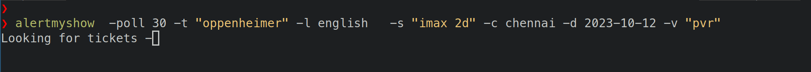

# alertmyshow
A go library and cli tool to check if  movie booking is started on Paytm.


quck check



poll mode


## Install
```
go install github.com/anoop142/alertmyshow/cmd/alertmyshow@latest
```

## Usage as CLI
```
./alertmyshow -t title -l language -screen screen_type -d yyyy-mm-dd -v theatres(comma separated) -c city [-poll poll_in_minutes] [-list]
  -c string
    	city
  -d string
    	date
  -l string
    	movie language
  -poll int
    	poll time in minutes
  -list bool
    	list venues
  -s string
    	screen type ("2d" | "3d" | "imax-2d" | "imax-3d" )
  -t string
    	movie title
  -v value
    	venues comma separated
  -version
        print version
    
```

### List all theatres available for booking
```
alertmyshow  -t "oppenheimer" -list -l english   -s "imax 2d" -c chennai -d 2023-10-12

```


### Note: screen type has to be one of "2d", "3d",  "imax-2d" or "imax-3d"

### Check if booking started
```
alertmyshow  -t "oppenheimer" -l english   -s "imax 2d" -c chennai -d 2023-10-12 -v "pvr,luxe"

```

### Example Poll Mode
In this mode alertmyshow will keep polling the api every n minutes specified.
```
alertmyshow -poll 30 -t "oppenheimer" -l english   -s "imax 2d" -c chennai -d 2023-10-12 -v "pvr"

```

## Usage as Library
```go
package main

import(

	"github.com/anoop142/alertmyshow"
)

venues := "pvr, inox"
//          alertmyshow.NewMovie(title, language, city, screen_type, yyyy-mm-dd)
movie, _ := alertmyshow.NewMovie("oppenheimer", "english", "chennai", "imax 2d", "2023-08-10")

venues, _ := movie.GetVenues()
for _, v := range venues{
    fmt.Println(v.Name)
    }

```
### How do I get alerts?
Alerting feature is not built into the library or the cli(ironically).
You need to add your own alerting system. The commandline tool just tells
you whether booking is started or not.

For example you could use a script to push alert to your telegram channel using a bot.

### Example script to push messages to telegram channel using a bot.
```bash
#! /bin/bash
set -e


alertmyshow -poll 30  -t "oppenheimer" -l english   -s "imax 2d" -c chennai -d 2023-10-06 -v "pvr"


curl -X POST \
     -H 'Content-Type: application/json' \
     -d '{"chat_id": "$CHAT_ID", "text": "Tickets Available now", "disable_notification": false}' \
     https://api.telegram.org/bot$BOT_TOKEN/sendMessage


```
